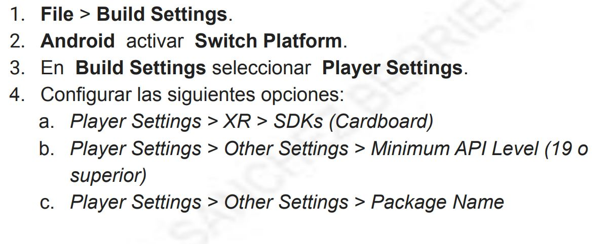
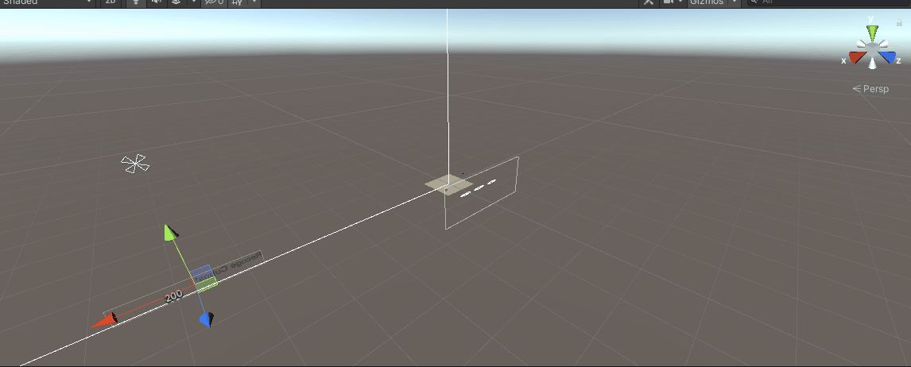

# Cardboard_Eduardo_Suarez_Ojeda

### Primeros pasos:

Para empezar he realizado los siguientes pasos para poder desarrollar el proyecto para android vr cardboard:

También he creado un objeto vacío que haga de padre de la cámara y un objeto vacío que haga de padre de los 3 prefabs:

- GrvEditor Emulator
- GrvControllerMain
- GrvEventSystem

Además he agregado a la cámara el GvrReticlePointer y le he añadido el component GvrPointerPhysicsRaycaster.

También a la hora de crear el canvas con los botones le he añadido al propio canvas el componente Gvr Pointer Graphics Raycaster, y eliminando el Graphics Raycaster que contenía previamente.

Así queda la jerarquía:

### Movimiento de la cámara:

Una vez que tenemos todos los prefabs de Cardboard listos podemos entrar en la simulación y mover la cámara mediante el uso del ratón y la tecla alt y mediante control y el movimiento del ratón podemos girar sobre YZ.

### GameController:

Para controlar todos los elementos de la escena creo una clase GameController en el objeto vacío que guarda la cámara. Mediante dicha clase se controlará el número de cubos recolectados y el color al que deben transformarse las esferas.

### Cubos recolectables:

En la práctica nos piden dos tipos de elementos interactivos en la escena, para empezar los cubos. Deben poder recolectarse mediante hacer click al apuntar sobre ellos con el puntero. Para ello creo un cubo al que le genero una función en la que aumento el contador del GameController y elemino el cubo, a la vez que modifico el texto que se presenta en el canvas incrustado sobre la cámara que nos informa de la cantidad de cubos que hemos recolectado hasta ahora. Para ello le añado un componente Event Trigger y dentro del mismo un tipo de evento Pointer Click, al cual le añado dicha función.

### Esferas que cambian de color:

Para realizar este ejercicio he creado un canvas externo que guarda los tres botones que corresponden a los 3 colores a los que se puede transformar las esferas al clickar cuando la retícula está sobre ellas, y mediante una función cambian el elemento correspondiente al color al que se transforman las esferas, que se encuentra dentro del GameController. Para ello le añado un componente Event Trigger y dentro del mismo un tipo de evento Pointer Click, al cual le añado dicha función.

Por último creo el elemento esfera y le añado la función que modifica su color al que se encuentre en ese momento seleccionado mediante su atributo de la clase GameController, le añado el componente Event Trigger y le asocio la función al evento Pointer Click.

